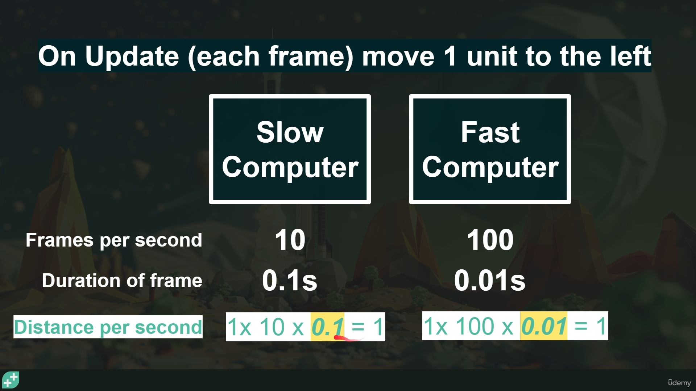

1) Edit -> Project Settings ->  When entering Play Mode -> Do not reload Domain or Scene => Will kepp windows poping when hitting PLAY button
Old way of taking inputs -> Edit -> Proj. Settings -> Player -> Other SettiNgs -> Active Input Handlping -> OLD
time.delatime -> How long each frame took to execute, when we multiplay by time.deltatime then game is frame rate independent
- It will behave same on slow and fast computers

[SerializeField] Variable will show up in Unity Editor